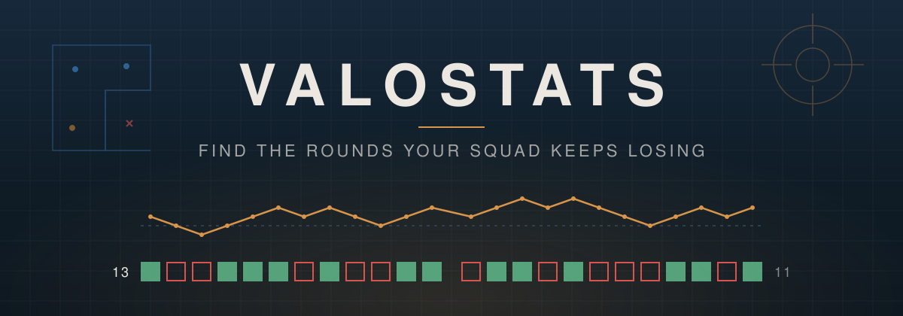
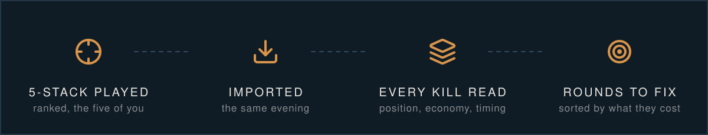
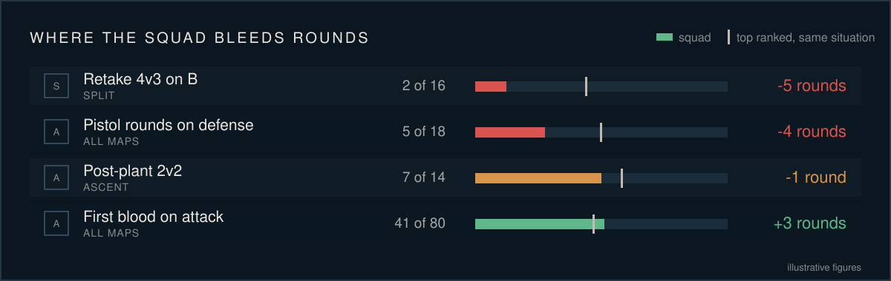
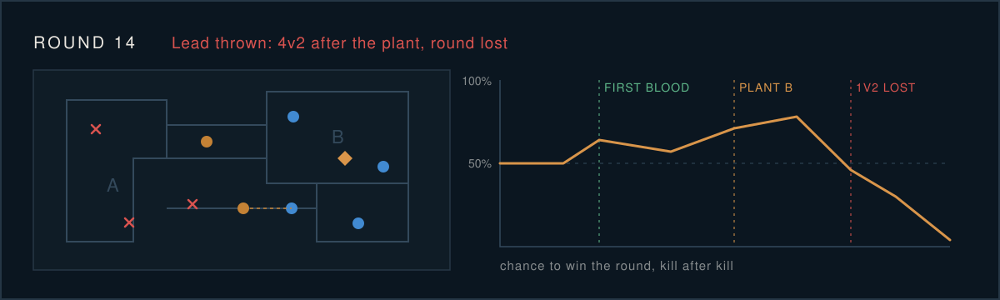

  

  <strong>Every lost round has a reason. ValoStats finds the ones that keep coming back.</strong>

---

## The scoreboard says who topped the frags. It never says why you lost 13 to 11.

Your squad reviews a match, agrees it was "the economy" or "the retakes", and queues again. Next week,
same map, same feeling. ValoStats reads every ranked 5-stack you play, kill by kill, and tells you which
situations actually cost you rounds, how many, and on which maps. No VOD to scrub. No spreadsheet. No
guessing.

  

---

##  Rounds, not percentages.

A dense table of rates tells you nothing at 1 a.m. ValoStats speaks one currency: **rounds won or
lost against the top ranked in the same situation**. A pistol leak, a retake leak and one map against
another finally compare on the same scale.

  

- **Real counts, always.** "2 of 16", never a lonely 13%.
- **Sorted by cost.** The costliest problem sits on top; small samples are greyed out at the bottom.
- **Colour follows the written gap.** A figure and its colour never contradict each other.

---

##  Three mirrors for every figure.

Every cell carries the squad's value and its sample, next to three references. Pick the one that
answers your question.

| Reference | What it tells you |
|---|---|
|  **Top ranked** | What the top 20 of every region do in the same spot |
|  **Opponents** | The teams you actually faced, at your elo, in the very same matches |
|  **History** | The squad itself before the period: are you getting better? |

Per-player rows compare like with like: a duelist against duelists, a controller against controllers.

---

##  Only gaps that survive the maths.

Strengths and weaknesses are statistical tests, not hunches. A gap that survives the
Benjamini-Hochberg correction is marked **Écart net**. One that only clears p < 0.05 is marked **À
confirmer**: worth watching, not worth a team meeting. Everything else stays quiet.

Correlations that are true by construction are left out. Stats a coach cannot act on are left out.

---

##  Every round, replayed.

Open any round and see it: positions at every kill and plant on the minimap, the economy of both
teams, and the chance to win the round moving kill after kill.

  

Each lost round gets a cause, computed from its timeline:

| | | |
|---|---|---|
| Lead thrown | Clutch lost | Post-plant lost |
| Retake failed | Opening lost | Economy gap |
| Execute failed | Duels lost | Time out |

---

##  Fourteen domains. More than 150 stats. Each one explained.

| | | |
|---|---|---|
|  Results |  Openings |  Combat |
|  Revenge and spacing |  Situations (4v3, 1v2...) |  Spike, plants, retakes |
|  Economy |  Weapons |  Utility |
|  Timings |  Positions |  Agents and comps |
|  Context |  Behaviour | |

Written in the squad's own words: full buy, eco, first blood, revenge, retake, post-plant, throw. Every
stat has an "i" that explains it like a teammate would, and the glossary gathers them all.

---

## For the squad. And for the coach.

|  Players |  Coaches and analysts |
|---|---|
| The three situations that cost the most this month | Fourteen domains, by map, side and player |
| Your own sheet: form, agents, weapons, death spots | Gaps tested against three references |
| Rounds to rewatch, one click away | Player against player, or the squad against its own past |
| The evening's matches, scoreboard by scoreboard | Where you die, where you plant, on the real minimaps |

Maps are imposed in ranked, so map verdicts are about **where to invest practice**, never pick or ban.

---

##  Inside

| View | What it shows |
|---|---|
|  **Tableaux** | Every domain as a coloured table, against the reference of your choice |
|  **Points forts et faibles** | Tested strengths and weaknesses, with the rounds behind each one |
|  **Comparateur** | The squad against its past, its opponents or the top ranked; or player against player |
|  **Minimap** | Kills, deaths, first bloods, plants and isolated deaths on the real map, zone by zone |
|  **Rounds** | Filterable list, round sheet, 2D replay, win probability |
|  **Matchs** | Evenings, scoreboards, round strips and why each round was lost |
|  **Joueurs** | One sheet per player, compared with their own role |
|  **Tendance** | Key stats month by month, patch by patch or match by match |
|  **Distribution** | Timings, distances, damage and ACS as histograms, against the top ranked |
|  **Glossaire** | Every stat, explained in player words |

A report covers a month, a patch, an evening or any date range, and its address is shareable.

---

  Angular front end · FastAPI and PostgreSQL · matches from the HenrikDev API 
  <a href="backend/README.md">backend</a> · <a href="frontend/README.md">frontend</a> · <a href="docs/ARCHITECTURE.md">architecture</a> · <a href="docs/VISION.md">vision</a>

